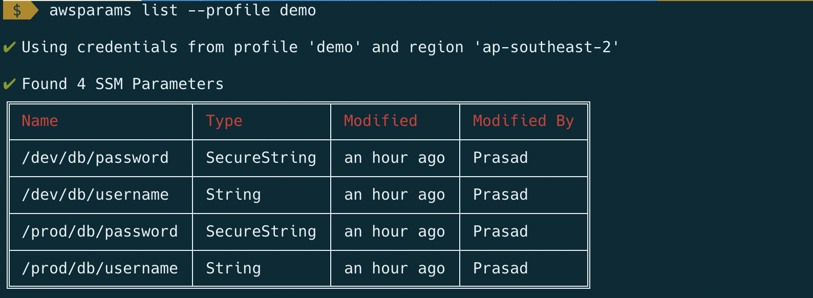
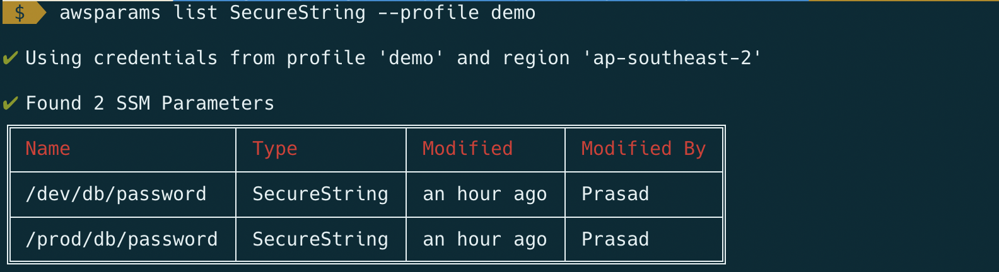
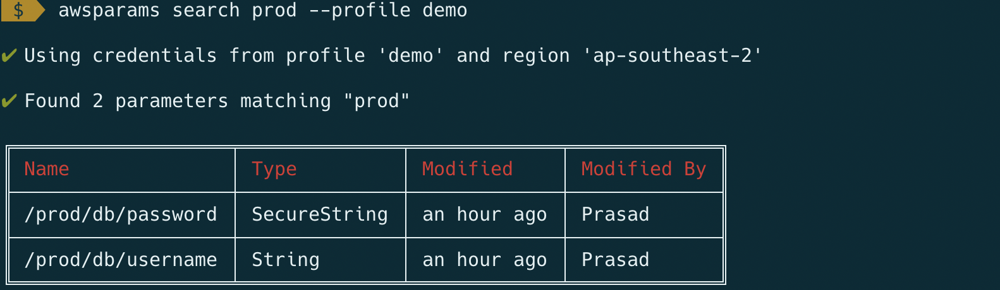
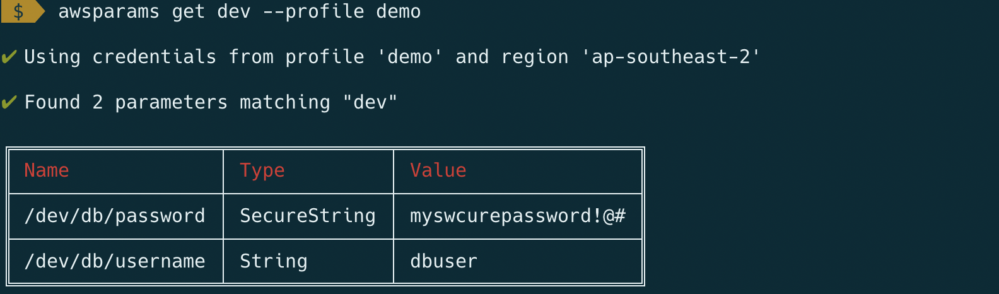

# AWSPARAMS

Wildcard searching of SSM Paramaters on AWS console is not a good experience especially if you have hundreds of path based SSM paramaters.
This CLI tool helps you to search and view SSM Paramaters.

Note: Adding and updating parameters will be added soon.

## Installation

Install
```
npm install -g awsparams
```

View usage
```
awsparams -h
```

## AWS Credenttials & Region

The CLI uses the credentials / profile / AWS environment variables set in your terminal.

You can use `--profile <profile-name>` to explicitly specify the profile.

Region is determined from profile / AWS_DEFAULT_REGION environmentt variable.

You can use `--region <region-code>` to explicitly specify the region

## List Parameters

List all SSM Parameters
```
awsparams list --profile demo
```


List all SSM Parameters of specific type
```
awsparams list SecureString --profile demo
```


## Search Parameters

Search SSM Parameters containing 'prod'
```
awsparams search prod --profile demo
```


## Get Parameter/s Values

Get values for SSM Parameter names containing 'dev'

```
awsparams get dev --profile demo
```

